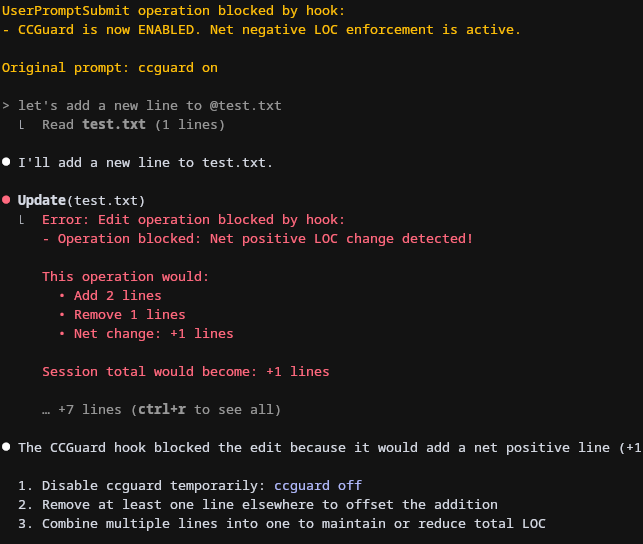

# 🚨 CCGuard

[](https://www.npmjs.com/package/ccguard)
[](LICENSE)

**Automated enforcement of net-negative LOC, complexity constraints, and quality standards for Claude code**

---

## 🎯 Overview

**CCGuard** ensures your codebase stays lean by blocking changes that exceed your configured line count threshold during Claude coding sessions. By default, it enforces net-negative changes (no increase allowed), but can be configured with a positive lines buffer for flexibility. It encourages simplicity, thoughtful refactoring, and a cleaner, maintainable codebase.

<p align="center"></p>
<p align="center"><i>CCGuard blocking a file edit that would increase total lines of code</i></p>

---

## ✅ Key Benefits

* **Flexible Enforcement**: Strict net-negative by default, but configurable with positive line buffer
* **Simplicity Focus**: Keeps your code concise by limiting unnecessary additions
* **Promotes Refactoring**: Encourages rethinking and optimizing existing code
* **Progress Insights**: Provides real-time session statistics
* **Easy Control**: Simple toggling for flexible enforcement

---

## 🛠️ Installation

Ensure you have:

* Node.js 18+
* Claude Code

Install CCGuard CLI globally:

```bash
npm install -g ccguard
```

---

## 🚀 Quick Start

### 1️⃣ Configure Claude Code Hooks

CCGuard requires two hooks to be configured in Claude Code:

#### A. PreToolUse Hook (for LOC enforcement)

> ⚠️ **CRITICAL NOTE**: CCGuard must be the **ONLY** hook configured for PreToolUse events with the `Write|Edit|MultiEdit` matcher. Due to a current Claude Code bug (as of v1.0.58), duplicate hooks for the same tool matcher do not work properly. If you have other hooks for these tools, you must remove them for CCGuard to function correctly.

1. Type `/hooks`
2. Select `PreToolUse - Before tool execution`
3. Click `+ Add new matcher...`
4. Enter: `Write|Edit|MultiEdit`
5. Click `+ Add new hook...`
6. Enter command: `ccguard`
7. Save settings (Project settings recommended)

#### B. UserPromptSubmit Hook (for ccguard commands)

1. Type `/hooks`
2. Select `UserPromptSubmit - When user submits a prompt`
3. Click `+ Add new hook...`
4. Enter command: `ccguard`
5. Save settings (Project settings recommended)

#### Configuration Reference

```json
{
  "hooks": {
    "PreToolUse": [{
      "matcher": "Write|Edit|MultiEdit",
      "hooks": [{"type": "command", "command": "ccguard"}]
    }],
    "UserPromptSubmit": [{
      "hooks": [{"type": "command", "command": "ccguard"}]
    }]
  }
}
```

### 2️⃣ Usage

CCGuard automatically checks file operations. Control using:

```bash
ccguard on      # Enable enforcement (default)
ccguard off     # Disable enforcement
ccguard status  # Show status and LOC statistics
ccguard reset   # Reset session statistics
```

---

## ⚙️ How CCGuard Works

CCGuard tracks three operations in Claude Code:

* **Edit**: Tracks changed lines
* **MultiEdit**: Cumulative tracking across edits
* **Write**: Counts lines in new files as additions

CCGuard blocks operations that result in net-positive LOC:

* Calculates additions vs removals
* Updates totals and provides clear feedback

### 📝 Examples

With default settings (`allowedPositiveLines: 0`):

| Operation                                   | Allowed?  |
| ------------------------------------------- | --------- |
| Refactor 10 lines into 5 (-5 net)           | ✅ Allowed |
| Replace 3 functions with 1 concise function | ✅ Allowed |
| Add new 20-line function without removal    | ❌ Blocked |
| Create new file without removals            | ❌ Blocked |

With positive buffer (`allowedPositiveLines: 10`):

| Operation                                   | Allowed?  |
| ------------------------------------------- | --------- |
| Add 8 lines, remove 0 (+8 net)              | ✅ Allowed |
| Add 15 lines, remove 0 (+15 net)            | ❌ Blocked |
| Session total: +5, new operation: +4        | ✅ Allowed |
| Session total: +8, new operation: +5        | ❌ Blocked |

---

## 📌 Configuration

Customize CCGuard with `.ccguard.config.json` in your project root:

```json
{
  "enforcement": {
    "mode": "session-wide",        // or "per-operation"
    "ignoreEmptyLines": true
  },
  "whitelist": {
    "patterns": [                  
      "**/node_modules/**",
      "**/dist/**",
      "**/*.generated.*"
    ],
    "extensions": [                
      ".md",
      ".json",
      ".lock"
    ]
  },
  "thresholds": {
    "allowedPositiveLines": 0
  }
}
```

### ⚙️ Options

* **Mode**:
  * `session-wide`: Track cumulative LOC (default)
  * `per-operation`: Check each operation individually

* **Thresholds**:
  * `allowedPositiveLines`: Buffer for positive changes (default: 0)
    * `0` = Strict net-negative enforcement
    * `10` = Allow up to +10 lines net change
    * Applies to both session-wide and per-operation modes

* **Whitelist**: Skip files by pattern or extension

* **Empty Lines**: Optionally ignore empty lines (default: true)

---

## 💡 Best Practices

* **Start Fresh**: Use `ccguard reset` before new tasks.
* **Refactor First**: Optimize code before additions.
* **Think Modular**: Create reusable components.
* **Question New Code**: Always assess necessity.

---

## ⚠️ Limitations

* Tracks changes only within a Claude Code session.
* Session statistics are not persistent across sessions.
* Changes outside Claude Code are not tracked.

---

## 🤝 Contributing

CCGuard is very new and we welcome any new ideas that would make it better! We're excited to hear your suggestions for new features, better workflows, and creative use cases. Submit issues and pull requests on GitHub.

Inspired by [tdd-guard](https://github.com/nizos/tdd-guard).

---

## 📄 License

[MIT](LICENSE)
